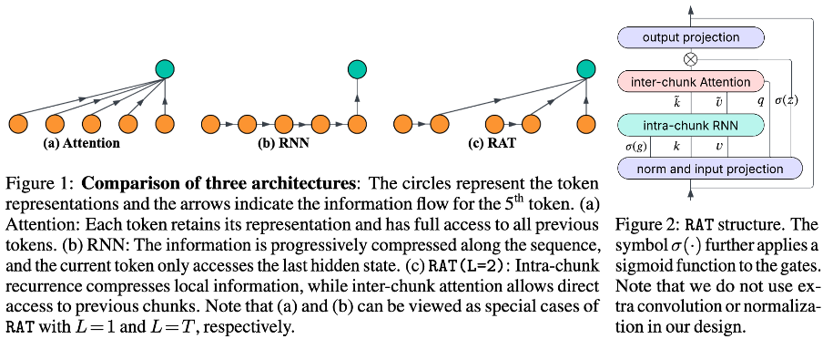

# 🐭 RAT 

## Intro
**RAT: Bridging RNN Efficiency and Attention Accuracy in Language Modeling**

Xiuying Wei, Anunay Yadav, Razvan Pascanu, Caglar Gulcehre


>  Transformers have become the cornerstone of modern large-scale language models; however, their dependence on softmax attention poses a major computational bottleneck, particularly in long-context settings. In this work, rather than following prevalent approaches such as linear attention (or SSMs) and local attention, we introduce an intermediate design called RAT between recurrence and attention mechanisms. It partitions the input into chunks, applies a simple linear recurrence within each chunk to capture local dependencies, and then performs softmax attention across chunks to model long-range interactions. By adjusting the size of the chunk, RAT enables flexible trade-offs, combining the strengths of RNN and attention. Empirically, with a chunk size of 16, the RAT layer achieves a $7\times$ improvement in training speed with 100K token sequences and $9\times$ in generation at 4K sequence length, while maintaining similar or sometimes even better accuracy compared to standard attention. We demonstrate this by training 1.3B parameter models from scratch and performing large-scale evaluations, including short- and long-context benchmarks, as well as supervised fine-tuning~(SFT). We further propose a hybrid architecture that interleaves RAT with local attention. By combining efficient long-range modeling with strong local interactions, this hybrid design not only improves inference speed and reduces cache memory usage compared to attention, but also consistently enhances performance, for example, achieving an average 1 point gain in commonsense reasoning tasks, up to 4 points on code tasks, and a 1 point Rouge-L increase in a summarization SFT task.

## File Organization
```
├── configs
│   ├── config.yaml
│   ├── data
│   ├── experiment:  entry to launch experiments
│   ├── model
│   ├── optim
│   ├── task
├── src
│   ├── benchmark_acc: entry to benchmark accuracy
│   ├── benchmark_eff: entry to benchmark efficiency
│   ├── data
│   ├── model
│   ├── model
│   │   ├── backbone: sequence model backbone, and layers, including attention, ffn, rat (ours), and rnn
│   │   ├── embedding: lm embedding and positional embedding
│   │   ├── head: lm head
│   ├── optim: lr scheduler and optimizer
│   ├── task: concatenate backbone, embedding, and head, and also metric and loss
│   ├── trainer: ddp trainer
│   ├── utils
```

## Env
We provide the environment in the Dockerfile

## Pretraining
* Prepare training data
    ```
    # downloading
    from datasets import load_dataset
    ds = load_dataset("HuggingFaceFW/fineweb-edu", "sample-100BT")
    # tokenize the data with LlaMA2 tokenizer
    cd tokenize && python fineweb_edu.py --tokenizer llama --num_proc 32
    ```

* pretraining the 1.3B model on 100B tokens
    ```
    torchrun --nnodes=4 --nproc_per_node=4 lm.py experiment=fineweb_edu/attention-xl
    torchrun --nnodes=4 --nproc-per-node=4 lm.py experiment=fineweb_edu/rat-xl
    torchrun --nnodes=4 --nproc-per-node=4 lm.py experiment=fineweb_edu/rnn-xl
    # interleave with local attention
    torchrun --nnodes=4 --nproc_per_node=4 lm.py experiment=fineweb_edu/attention_localattention_interleave-xl
    torchrun --nnodes=4 --nproc-per-node=4 lm.py experiment=fineweb_edu/rat_localattention_interleave-xl
    ```
    We obtain the perplexity shown in Figure 4(c).

## Downstream results
After we obtain the pretrained models, we can conduct different downstream evaluations with them. Detailed configurations can be found in Appendix A.2.
* Table 2. We evaluate it using [lm-evaluation-harness](https://github.com/EleutherAI/lm-evaluation-harness) repo. We provide necessary files in eval/lm_harness

* Table 3. We evaluate it using [LongBenchV1](https://github.com/THUDM/LongBench) repo. We provide necessary files in eval/longbench.

* Table 4. As it is hard for pretrained-only models to deal with heavy prompt-style datasets in LongBench, we also compare different models on some SFT datasets.

    ```
    # prepare train/val/test data
    cd tokenize && python sft.py --task narrativeqa_summary --num_proc 32 --max_length 4096 --split train

    # fine-tuning the pretrained model on narrativeqa_summary by specifying data.\_name\_
    export config="optim.optimizer.lr=1.0e-5 data.global_batch_size=128 trainer.max_epoch=1 data._name_=narrativeqa_summary"
    torchrun --nnodes=1 --nproc-per-node=4 lm.py experiment=sft/rat-xl ${config}

    # generate answers
    export config="optim.optimizer.lr=1.0e-5 data.global_batch_size=128 trainer.max_epoch=1 data._name_=narrativeqa_summary"
    torchrun --nnodes=1 --nproc-per-node=4 generation.py experiment=sft/rat-xl  wandb_use=false ${config}"

    # use eval/sft_eval to score the answers
    ```

* Table 12. We evaluate using [RULER benchmark](https://github.com/NVIDIA/RULER) repo. We provide necessary files in eval/ruler.


## Efficiency results
We test latency on the GH200 GPU.
* single layer (including the input and output projections)

    ```
    cd src/benchmark_eff
    python attention_eff.py 
    python rnn_eff.py
    python rat_eff.py
    ```
* whole model's maximum throughput
    ```
    cd src/benchmark_eff
    # we run it twice. The first time is used to find the maximum batch size we can set. The second time is used to test the latency.
    torchrun --nnodes=1 --nproc-per-node=1 model_eff.py experiment=fineweb_edu/rat-xl
    ```
